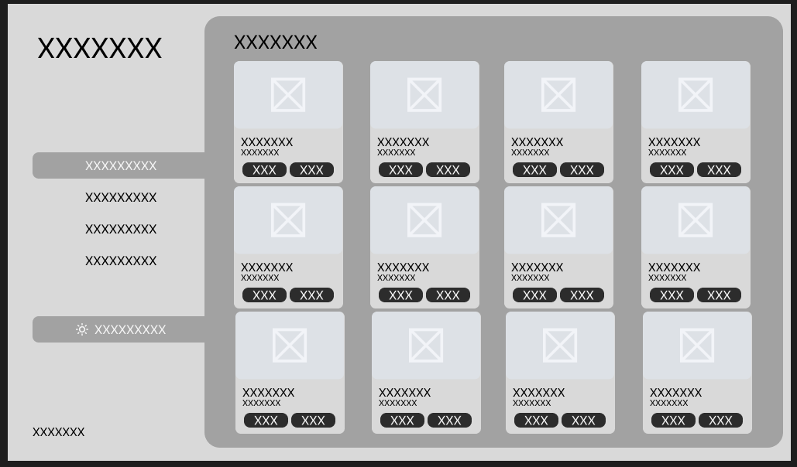
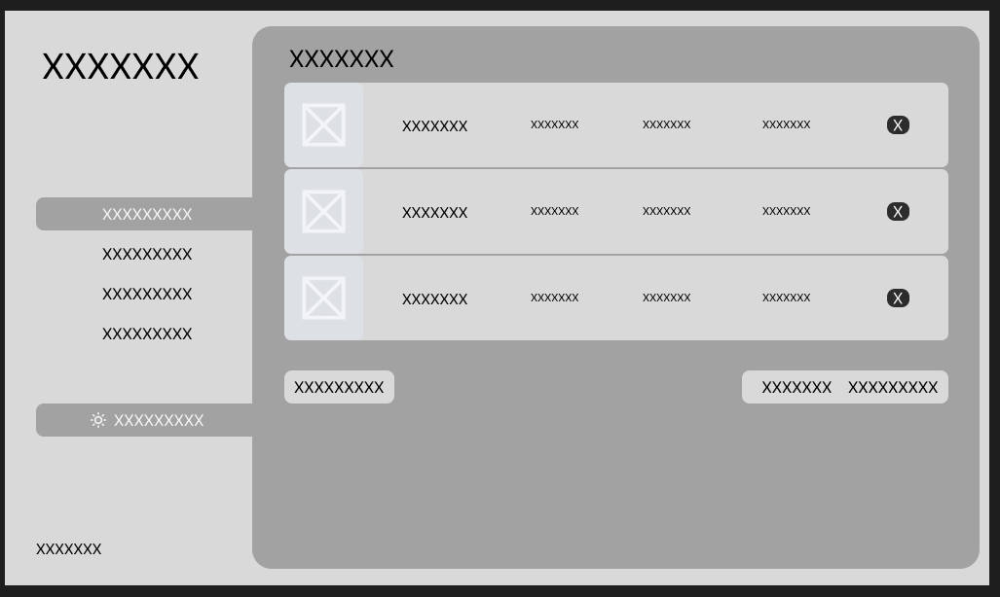
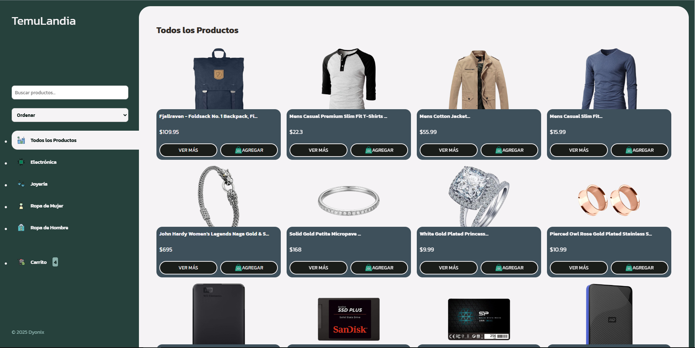
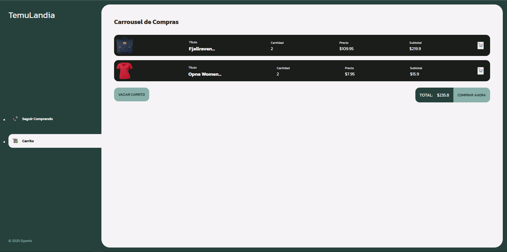

# 🛍️ TemuLandia - Tienda Online

**SKILL JAVASCRIPT**  
**PROYECTO – FakeStore**

---

## 📋 Descripción del Proyecto

TemuLandia es una aplicación web moderna que consume datos desde la API pública [FakeStore](https://fakestoreapi.com/products) para crear una experiencia de compra interactiva y funcional. La aplicación permite a los usuarios navegar productos, filtrarlos por categorías, buscarlos en tiempo real, agregarlos al carrito y realizar compras con persistencia de datos.

### ✨ Características Principales

- **📡 Consumo de API**: Integración completa con FakeStore API
- **🛒 Carrito de Compras**: Sistema completo con localStorage para persistencia
- **🔍 Búsqueda en Tiempo Real**: Filtra productos mientras escribes
- **📱 Diseño Responsivo**: Adaptado para desktop, tablet y móvil
- **🎯 Filtros por Categoría**: Electrónica, Joyería, Ropa de Hombre y Mujer
- **💾 Persistencia de Datos**: El carrito se mantiene al recargar la página
- **🎨 Interfaz Moderna**: Diseño atractivo y fácil de usar

### 🛠️ Tecnologías Utilizadas

- **HTML5**: Estructura semántica y moderna
- **CSS3**: Diseño responsivo con Flexbox y Grid
- **JavaScript ES6+**: Funcionalidad moderna con async/await
- **Fetch API**: Para consumo de datos de la API
- **LocalStorage**: Persistencia de datos del carrito
- **Google Fonts**: Tipografía Kanit para una apariencia moderna

---

## 🚀 Instalación y Uso

### Requisitos Previos
- Navegador web moderno (Chrome, Firefox, Safari, Edge)
- Conexión a internet (para consumir la API)

### Pasos de Instalación

1. **Clonar el repositorio**:
   ```bash
   git clone [URL_DEL_REPOSITORIO]
   cd TemuLandia
   ```

2. **Abrir la aplicación**:
   - Simplemente abre `index.html` en tu navegador
   - O usa un servidor local como Live Server en VS Code

3. **Navegar la aplicación**:
   - La página de bienvenida se carga automáticamente
   - Serás redirigido a la tienda principal
   - Explora productos, agrega al carrito y gestiona tus compras

---

## 📁 Estructura del Proyecto

```
TemuLandia/
├── index.html          # Página de bienvenida/splash screen
├── inicio.html         # Página principal de la tienda
├── carrito.html        # Página del carrito de compras
├── css/
│   ├── main.css        # Estilos principales
│   └── bienvenida.css  # Estilos de la página de bienvenida
├── js/
│   ├── main.js         # Lógica principal de productos
│   ├── carrito.js      # Funcionalidad del carrito
│   └── menu.js         # Gestión del menú móvil
└── img/                # Imágenes y recursos gráficos
    ├── logo.png
    ├── carrito.png
    ├── electronica.png
    ├── joyeria.png
    ├── ropahombre.png
    ├── ropamujer.png
    └── [otras imágenes]
```

---

## 🎯 Funcionalidades Implementadas

### ✅ Consumo de API
- Integración completa con `https://fakestoreapi.com/products`
- Manejo de asincronía con `async/await`
- Transformación de datos de la API
- Manejo de errores con try/catch

### ✅ DOM Dinámico
- Renderizado dinámico de productos
- Creación de elementos con `createElement()`
- Actualización del DOM en tiempo real
- Tarjetas de productos con información completa

### ✅ Carrito de Compras
- Agregar/quitar productos
- Cálculo automático del total
- Contador de productos en tiempo real
- Eliminación individual de productos
- Vaciado completo del carrito

### ✅ Persistencia con localStorage
- Guardado automático del carrito
- Recuperación de datos al recargar
- Sincronización entre páginas

### ✅ Eventos y Interactividad
- `click`: Agregar/quitar productos del carrito
- `change`: Filtros por categoría
- `input`: Búsqueda en tiempo real
- Navegación fluida entre páginas

### ✅ Filtros y Búsqueda
- Búsqueda por título de producto
- Filtros por categoría:
  - Electrónica
  - Joyería
  - Ropa de Mujer
  - Ropa de Hombre
  - Todos los productos

### ✅ Diseño Responsivo
- Breakpoints para móvil, tablet y desktop
- Menú hamburguesa para móviles
- Grid adaptativo de productos
- Navegación optimizada para touch

---

## 📸 Wireframe

### Vista Principal de Productos



### Vista del Carrito de Compras


---

## 📸 Capturas de Pantalla

### Vista Principal de Productos

*Página principal mostrando todos los productos disponibles con filtros y búsqueda*

### Vista del Carrito de Compras

*Carrito con productos agregados, total calculado y opciones de compra*

---

## 🔧 Evidencia de Desarrollo

### Análisis de Decisiones de Diseño

#### Estructura de Datos
- **Productos**: Estructura normalizada con `id`, `titulo`, `imagen`, `categoria`, `precio`
- **Carrito**: Array de objetos con cantidad y referencias a productos originales
- **LocalStorage**: Serialización JSON para persistencia

#### Justificación de Filtros y Ordenamientos
- **Búsqueda por texto**: Permite encontrar productos específicos rápidamente
- **Filtros por categoría**: Organización natural del inventario
- **Actualización en tiempo real**: Sin necesidad de botones adicionales
- **Navegación intuitiva**: Categorías con iconos descriptivos

#### Experiencia de Usuario
- **Feedback visual**: Confirmaciones al agregar productos
- **Contador dinámico**: Muestra cantidad total en el carrito
- **Estados vacíos**: Mensajes amigables cuando no hay productos
- **Navegación fluida**: Transiciones suaves entre secciones

### Wireframes y Bocetos
*Los wireframes y bocetos del diseño están disponibles en la carpeta de análisis del repositorio*

---

## 👨‍💻 Autor

**Proyecto desarrollado como parte del aprendizaje de JavaScript**

- **Nombre**: David Gamboa Orozco
- **Curso**: JavaScript
- **Institución**: CampusLands
- **Año**: 2025

---

## 📄 Licencia

Este proyecto está desarrollado con fines educativos.

---
